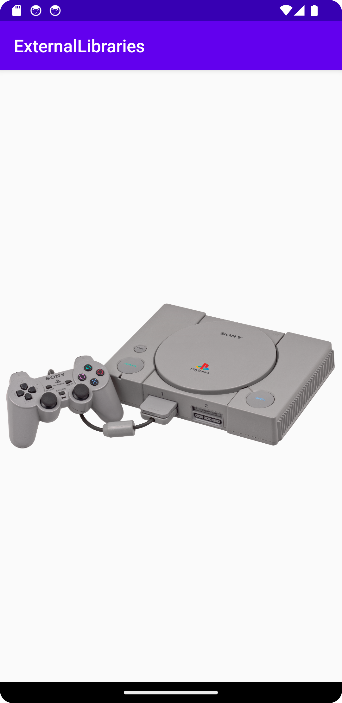

# Rapport

**App with Glide**

```
...
dependencies {
    ...
    implementation 'com.github.bumptech.glide:glide:4.16.0'
    ...
}
...
```
Jag har hittat ett bibliotek som heter Glide, och för att använda det måste man implementera en dependency i build.gradle (:app)-filen.

```
...
buildscript {
    
    repositories {
        ...
        mavenCentral()
    }
    ...
}
...
```
Det finns en till en kodrad som måste skrivas mavenCentral(), som måste implementeras i build.gradle (:ExternalLibraries)-filen.

```
...
<ImageView
        android:id="@+id/myImageView"
        android:layout_width="wrap_content"
        android:layout_height="wrap_content"
        app:layout_constraintBottom_toBottomOf="parent"
        app:layout_constraintEnd_toEndOf="parent"
        app:layout_constraintStart_toStartOf="parent"
        app:layout_constraintTop_toTopOf="parent" />
...
```
ImageView har skapas i activity_main.xml för att kunna ladda upp en bild på views.

```
...
ImageView imageView = findViewById(R.id.myImageView);

/*
Licence information
PSX-Console-wController.png by Evan-Amos used Public Domain
*/
Glide.with(this).load("https://upload.wikimedia.org/wikipedia/commons/9/95/PSX-Console-wController.png").into(imageView);
...
```
Det finns en funktion i MainActivity.java som söker efter id "myImageView" i activity_main.xml 
och sedan lagrar värdet i en variabel som heter "imageView".

Därefter använder Glide.with för att hämta variabeln "imageView" och ladda upp bilden till view. 
Funktionen load() används för att specificera URL för bilden."


Så här ser bilden ut i view. 
Observera att bilden kommer från internet, så det kan ta tid att ladda upp den.

License information:
[PSX-Console-wController.png](https://commons.wikimedia.org/wiki/File:PSX-Console-wController.png) 
by [Evan-Amos](https://commons.wikimedia.org/wiki/User:Evan-Amos) 
used [Public Domain](https://commons.wikimedia.org/wiki/File:PSX-Console-wController.png#Summary)

Läs gärna:

- Boulos, M.N.K., Warren, J., Gong, J. & Yue, P. (2010) Web GIS in practice VIII: HTML5 and the canvas element for interactive online mapping. International journal of health geographics 9, 14. Shin, Y. &
- Wunsche, B.C. (2013) A smartphone-based golf simulation exercise game for supporting arthritis patients. 2013 28th International Conference of Image and Vision Computing New Zealand (IVCNZ), IEEE, pp. 459–464.
- Wohlin, C., Runeson, P., Höst, M., Ohlsson, M.C., Regnell, B., Wesslén, A. (2012) Experimentation in Software Engineering, Berlin, Heidelberg: Springer Berlin Heidelberg.
